# Dr Stocks Backend Setup Guide
Prerequisite to run this project
1. WAMPServer
2. MySQL
3. Python
4. Docker
5. Postman

How to setup the backend services?
1. Unzip the zip file into a folder on your desktop
2. Open the backend folder and navigate to the "dr_stocks-backend/database" folder
3. Start the WAMPServer
4. Open all the SQL files using MySQL (via phpmyadmin or not) and execute/run all the files
4. Next, Open the "docker-compose.yml" file and change the docker id for the images to your own docker id.
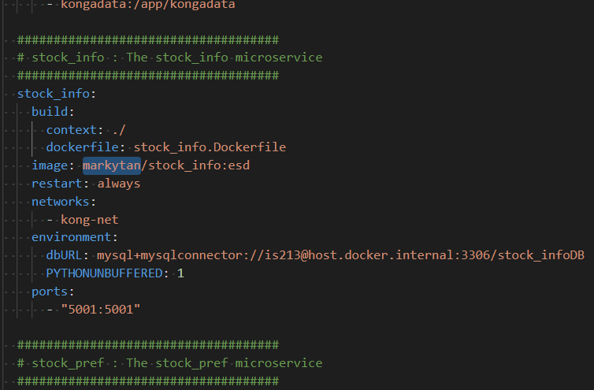
4. Make sure you have run the Docker application.
5. Open a cmd terminal and cd to the "dr_stocks-backend/microservices" folder.
6. After, proceed to type this command "docker-compose up -d" and hit enter to run it in the terminal. This will set up all the required services. 
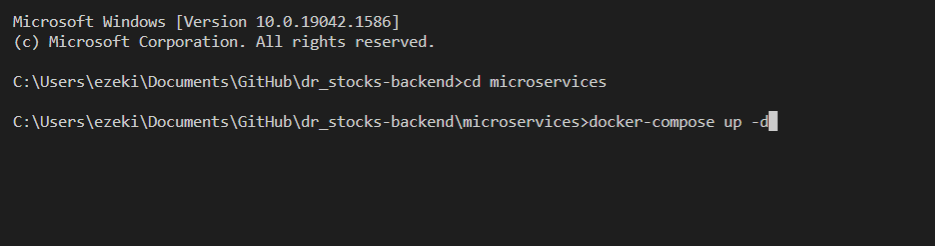
7. Wait for about 30 seconds after the containers have been created and started to let the services start up.
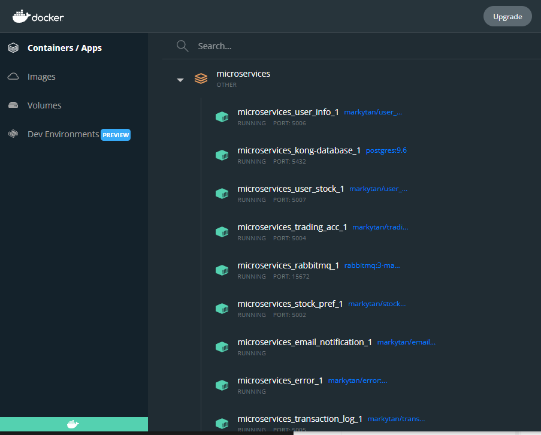
8. Next, type this URL "localhost:1337" in your browser to access the KONGA portal.
9. Create an admin account:

    Name: admin

    Email: Any email
    
    Password: password
    
    Confirm Password: password  
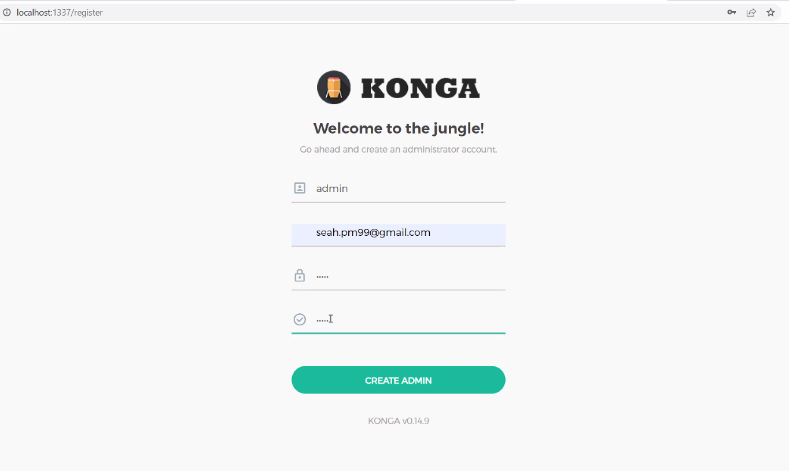

10. and set the default connection as this:

    Name: default
    
    Kong Admin URL: http://kong:8001
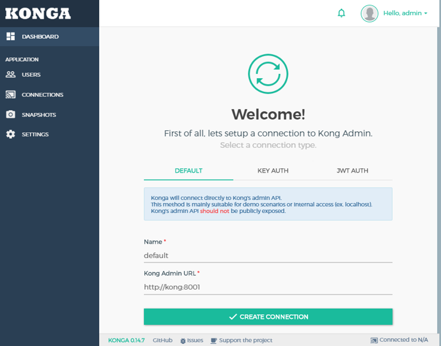

11. Next, proceed to the services page.
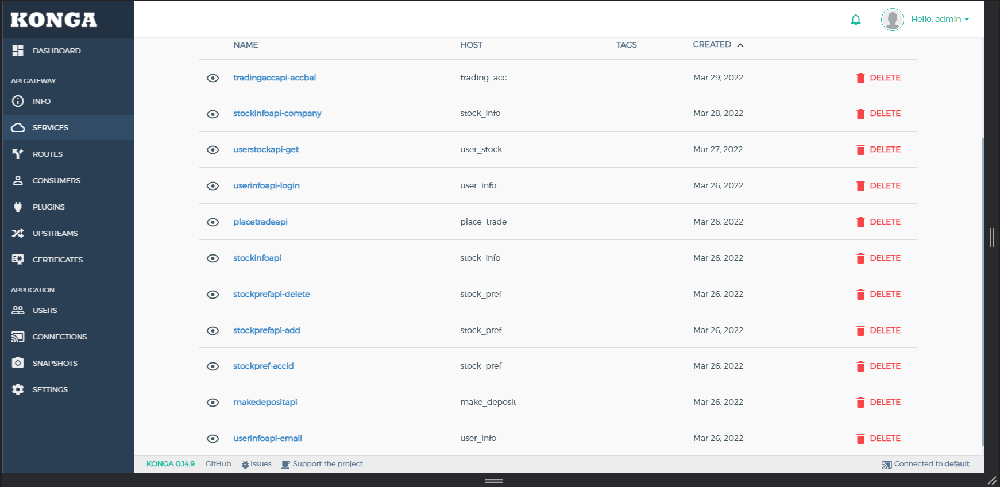
*It will be blank since no services has been added
10. Create all this services and routes as stated in the table 

    (can refer to the included word document: "KONG-Setup.docx"):
    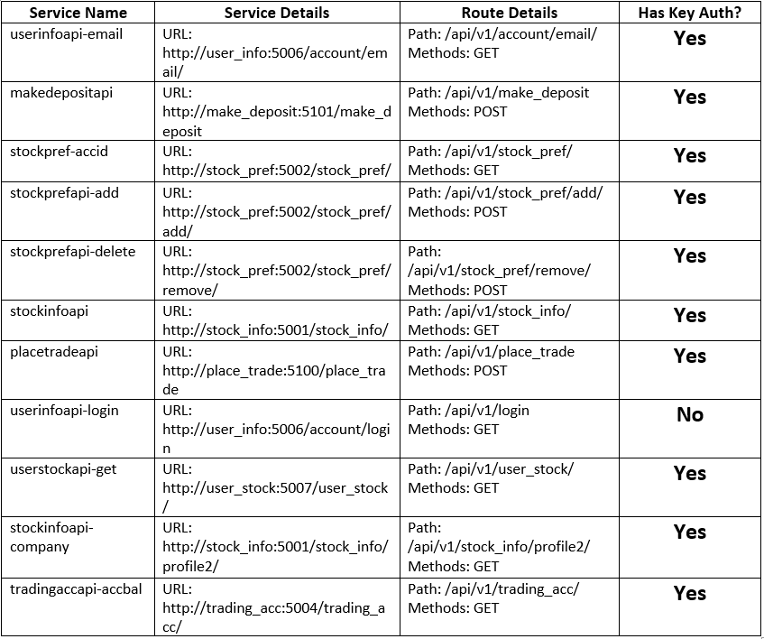
    
    
    You will be redirected to the dashboard page which is the default page:
    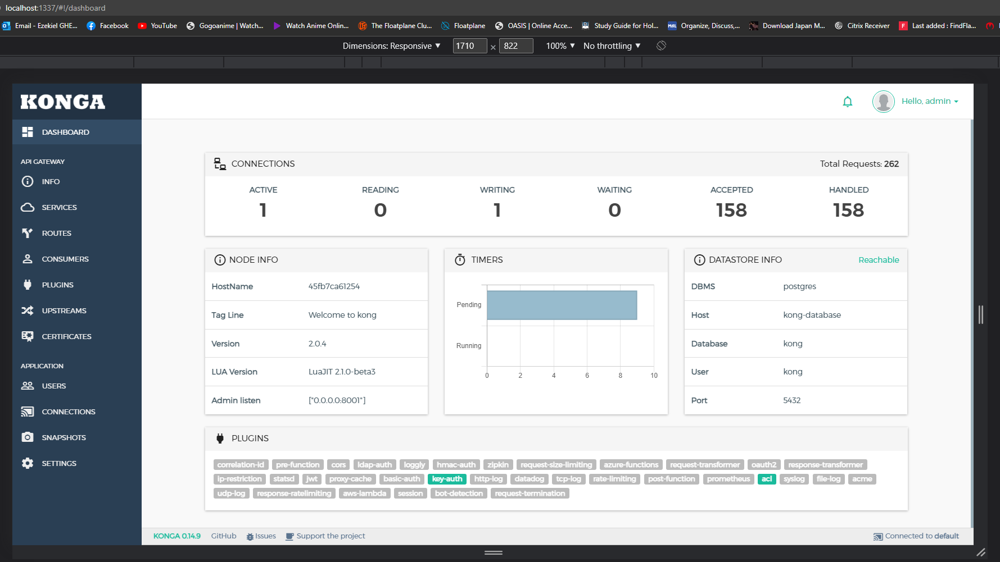

11. Next, go to the plugin tab for each service and add the Key Auth plugin for all services 

    EXCEPT LOGIN (userinfoapi-login).

    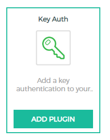
    
    For each Key Auth, under key names, add a key called "apikey" and hit enter and click add plugin at the bottom.
12. Next, navigate to the consumer tab (left nav bar) and create a consumer called "customer" and under the credentials tab, create an api key with the key as this "NTaKvMth2Syfjf30m9dmKWXzANDRqbzh".
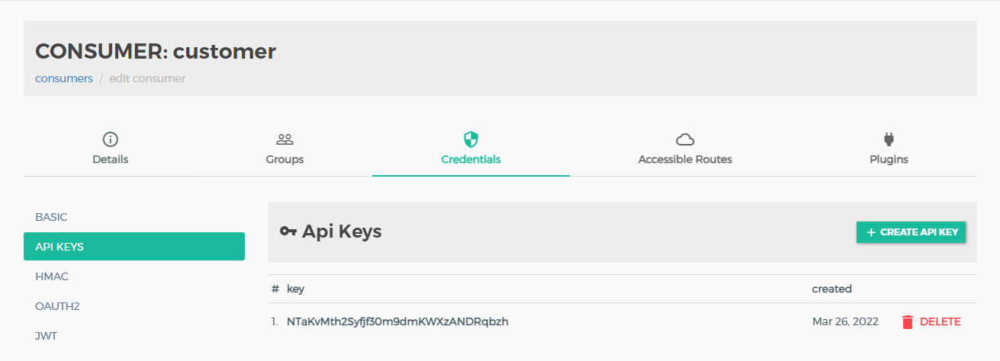

13. Also, under the groups tab, add a group called "customer".
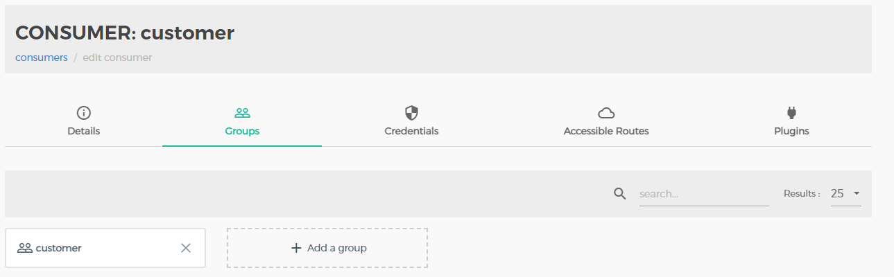

14. With this, you can open Postman and test the connection using this URL: 
    http://localhost:8000/api/v1/login?email=maryesther@gmail.com&password=dGVtcDE=
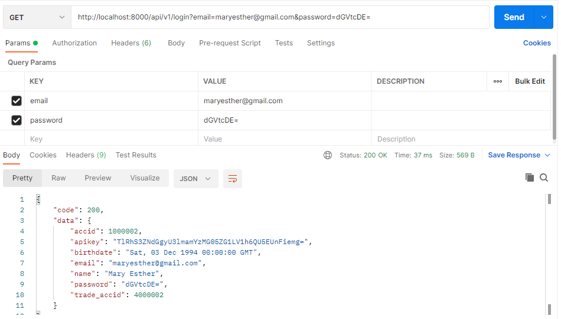

15. Lastly, once all has been configured or if you face any issues, please stop the all the microservices docker containers and start them again and wait for about 1 minute for all the services to complete starting up.

    

With this, you have successfully configured the backend services! You can proceed to setup the frontend services if you have not done so.